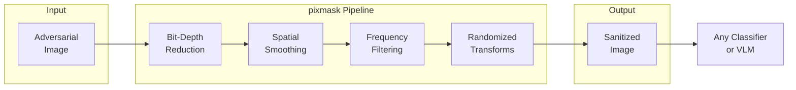

# pixmask

Model-agnostic preprocessing defenses to neutralize adversarial image attacks. Input transformations applied before inference to erase high-frequency perturbations while preserving human-salient content. No model retraining required.



## Defense Families

### 1. Feature Squeezing
Bit-depth reduction (8 -> 5 bits/channel) combined with spatial smoothing (median/Gaussian). Collapses tiny adversarial pixel changes onto the same quantized value.

### 2. Lossy Compression & Frequency Filtering
- **JPEG/WebP** -- DCT quantization discards high-frequency adversarial content
- **FFT/Wavelet** -- Project to compact basis, threshold high-frequency components, reconstruct
- **SHIELD** -- Randomized blockwise JPEG qualities with model vaccination

### 3. Spatial Smoothing
Gaussian, median, bilateral (edge-preserving), and non-local means filters to remove outliers and texture-scale noise.

### 4. Total Variation Minimization & Image Quilting
- **TVM** -- ROF minimization for piecewise-smooth reconstruction
- **Quilting** -- Replace patches with closest clean-patch-library matches, overwriting adversarial micro-textures

### 5. Randomized Transforms
Random resizing + padding and pixel deflection with wavelet denoising. Non-differentiable and stochastic, frustrating gradient-based attacks.

### 6. Scaling-Attack Defenses
Mitigations against images crafted to reveal different content after downscaling. Pixel-influence restoration and randomized interpolation.

## Project Structure

```
pixmask/
  src/
    cpp/
      bindings/module.cpp       # Python/C++ bridge
      include/fsq/
        common.hpp
        image_view.hpp
        pipeline.hpp
        filters/
          gaussian.hpp
          median.hpp
        quant/
          bitdepth.hpp
    tests/
      test_squeeze.py
  python/
    feature_squeeze/            # Python package
  CMakeLists.txt
  pyproject.toml
```

## Core Algorithms

| Algorithm | Method | Use Case |
|-----------|--------|----------|
| DCT Quantization | Block DCT -> quantize high-freq -> inverse DCT | JPEG-based defense |
| FFT Low-Pass | FFT -> circular low-pass mask -> inverse FFT | Blunt high-freq removal |
| Median Filter | Replace each pixel by median in k x k window | Salt-and-pepper noise |
| Bilateral Filter | Spatially local averaging weighted by intensity similarity | Edge-preserving smoothing |
| Bit-Depth Reduction | Map 256 levels -> 32 (or fewer) then rescale | Adversarial increment collapse |
| TV Denoising | Chambolle/Bregman/ADMM minimization | Oscillatory perturbation suppression |
| Wavelet Soft-Threshold | Decompose, shrink small coefficients, reconstruct | Sparse adversarial coefficient removal |

## References

- Xu, Evans, Qi -- "Feature Squeezing", NDSS 2018
- Guo et al. -- "Countering Adversarial Images via Input Transformations", ICLR 2018
- Das et al. -- "SHIELD: Fast, Practical Defense and Vaccination", KDD 2018
- Xie et al. -- "Mitigating Adversarial Effects Through Randomization", ICLR 2018
- Prakash et al. -- "Deflecting Adversarial Attacks with Pixel Deflection", CVPR 2018
- Quiring et al. -- "Adversarial Preprocessing: Image-Scaling Attacks", USENIX Security 2020
- Athalye, Carlini, Wagner -- "Obfuscated Gradients Give a False Sense of Security", 2018
