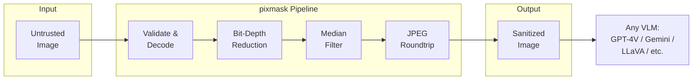

# pixmask

Blazing-fast image sanitization for multimodal LLM security. Pure C++ core with SIMD acceleration, Python bindings via nanobind. Zero runtime dependencies.

```
pip install pixmask
```



## Why pixmask?

Every image sent to a multimodal LLM is an attack surface. Adversarial perturbations, steganographic payloads, prompt injection via pixel manipulation, malformed files exploiting parser bugs -- pixmask neutralizes these threats in **<15ms** with a single function call.

| Threat | How pixmask stops it |
|--------|---------------------|
| Gradient perturbations (PGD, C&W) | Bit-depth reduction collapses adversarial increments |
| LSB steganography | Bit-depth crush overwrites hidden payload bits |
| DCT-domain steganography | JPEG roundtrip re-quantizes all DCT coefficients |
| Malformed/corrupt images | Strict validation gate before any decode |
| Scaling attacks | Safe resize with area interpolation (v0.2) |
| Neural steganography | Layered pipeline destroys embedded patterns |

### Compared to alternatives

| Library | Language | Latency (1080p) | Install size | VLM-focused? |
|---------|----------|-----------------|-------------|-------------|
| **pixmask** | **C++ / SIMD** | **<15ms** | **<5MB** | **Yes** |
| ART (IBM) | Python | 50-500ms | ~200MB | No |
| OpenCV preprocessing | C++ | ~10ms | ~50MB + libGL | No |
| DiffPure | Python + GPU | 500-5000ms | ~2GB | No |

## Quick Start

```python
import pixmask
import numpy as np

# One-liner: sanitize any image
safe_image = pixmask.sanitize(image_array)

# From raw bytes (e.g., API upload)
safe_image = pixmask.sanitize(raw_bytes)

# From file path
safe_image = pixmask.sanitize("uploaded_photo.jpg")

# Presets
safe_image = pixmask.sanitize(image, preset="fast")       # ~3ms, bit-depth + JPEG only
safe_image = pixmask.sanitize(image, preset="balanced")    # ~15ms, full pipeline (default)
safe_image = pixmask.sanitize(image, preset="paranoid")    # ~25ms, maximum defense

# Custom parameters
safe_image = pixmask.sanitize(image, bit_depth=4, jpeg_quality=(60, 80))

# Get bytes for API calls
safe_bytes = pixmask.sanitize(raw_bytes, output_format="jpeg")
```

### Integration with VLM APIs

```python
import pixmask

# Sanitize before sending to any VLM
with open("user_upload.jpg", "rb") as f:
    raw = f.read()

safe = pixmask.sanitize(raw, output_format="jpeg")

# Now pass `safe` to your VLM API of choice
```

## How It Works

pixmask applies a multi-stage defense pipeline:

### Stage 0: Input Validation
- Magic byte verification (PNG, JPEG, WebP only -- GIF/TIFF/SVG rejected)
- Dimension limits (max 8192x8192)
- File size limits (max 50MB)
- Decompression ratio check (prevents zip/PNG bombs)

### Stage 1: Safe Decode
- stb_image with compile-time format restriction (JPEG + PNG only)
- GIF, BMP, TGA, PSD, HDR, PIC, PNM all disabled at build time
- Pixels copied to SIMD-aligned buffer immediately, parser memory freed

### Stage 2: Bit-Depth Reduction
- Reduces 8-bit channels to 5-bit (configurable 1-8)
- Implemented with Google Highway SIMD (SSE2/AVX2/NEON)
- Collapses adversarial perturbations that hide in low-order bits
- Destroys LSB steganography as a side effect

### Stage 3: Median Filter (3x3)
- 19-step Bose-Nelson sorting network
- SIMD-accelerated via Google Highway
- Removes impulse noise and isolated adversarial pixels
- Edge-preserving for natural image content

### Stage 4: JPEG Roundtrip
- Encode to JPEG with **randomized** quality factor (70-85)
- Decode back to pixel buffer
- Quality randomized per-image using OS entropy (`getrandom`/`getentropy`)
- Destroys DCT-domain steganography and high-frequency perturbations
- Randomization prevents adaptive attacks that train through a fixed QF

## Architecture

```
pixmask/
  src/cpp/
    include/pixmask/       # Public C++ headers
      types.h               # ImageView, SanitizeOptions, SanitizeResult
      arena.h               # Zero-allocation bump-pointer allocator
      validate.h            # Stage 0: input validation
      decode.h              # Stage 1: stb_image wrapper
      bitdepth.h            # Stage 2: SIMD bit-depth reduction
      median.h              # Stage 3: SIMD median filter
      jpeg_roundtrip.h      # Stage 4: randomized JPEG roundtrip
      pipeline.h            # Pipeline orchestrator
    src/                    # Implementations + Highway SIMD dispatch
    bindings/module.cpp     # nanobind Python bindings
    third_party/            # Vendored: stb_image, stb_image_write, doctest
  python/pixmask/          # Python package
  src/tests/               # C++ (doctest) + Python (pytest) tests
```

### Design Principles

- **Zero runtime dependencies** -- numpy is the only optional peer dep
- **Pure C++17 core** -- no OpenCV, no scipy, no Pillow required
- **SIMD everywhere** -- Google Highway for portable SSE2/AVX2/NEON
- **Arena allocator** -- zero heap allocations in the hot path
- **Pre-built wheels** -- `pip install` just works, no compiler needed

## Building from Source

```bash
# Development build
pip install nanobind scikit-build-core[pyproject]
pip install --no-build-isolation -ve .

# C++ only (no Python)
cmake -S . -B build -DBUILD_TESTING=ON
cmake --build build -j$(nproc)
ctest --test-dir build
```

## Testing

```bash
# C++ tests
cmake --build build -j$(nproc)
ctest --test-dir build --output-on-failure

# Python tests (after pip install)
pytest src/tests/python/ -v
```

## Roadmap

### v0.2
- Bilateral filter (edge-preserving, Pareto-superior to median)
- Gaussian blur (3-pass box blur approximation)
- Haar wavelet denoising (strongest standalone defense)
- Pixel deflection (stochastic, non-differentiable)
- Safe resize with INTER_AREA + random jitter
- Upgrade decoders: libspng + libjpeg-turbo (replacing stb)
- Steganography detection signal (chi-square test)

### v0.3+
- OCR-based typographic attack detection
- Total variation denoising (Chambolle-Pock)
- Content-aware adaptive sanitization
- BPDA/EOT adaptive attack evaluation suite

## Limitations

pixmask is a **preprocessing defense layer**, not a complete security solution:

- **Typographic attacks** (FigStep) embed readable text in images. Pixel-level preprocessing cannot stop this -- OCR-based detection is needed (planned for v0.3).
- **Semantic content attacks** where the image itself is harmful content require content moderation, not sanitization.
- **Fully adaptive white-box adversaries** who know the exact pipeline can theoretically bypass any preprocessing defense (Athalye et al., ICML 2018). pixmask is effective against the realistic non-adaptive threat model.

## References

- Xu, Evans, Qi -- "Feature Squeezing: Detecting Adversarial Examples", NDSS 2018
- Guo et al. -- "Countering Adversarial Images via Input Transformations", ICLR 2018
- Das et al. -- "SHIELD: Fast, Practical Defense and Vaccination", KDD 2018
- Prakash et al. -- "Deflecting Adversarial Attacks with Pixel Deflection", CVPR 2018
- Qi et al. -- "Visual Adversarial Examples Jailbreak Aligned LLMs", AAAI 2024
- Gong et al. -- "FigStep: Jailbreaking VLMs via Typographic Prompts", AAAI 2025
- Athalye, Carlini, Wagner -- "Obfuscated Gradients Give a False Sense of Security", ICML 2018
- Quiring et al. -- "Adversarial Preprocessing: Image-Scaling Attacks", USENIX Security 2020

## License

MIT
